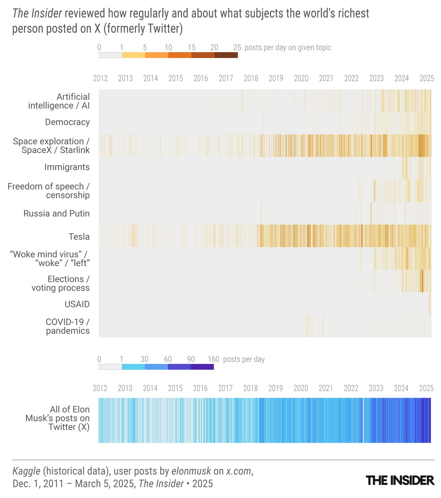

## Dataset

The current dataset we are working with is a dataset of [Elon Musk's tweets](https://www.kaggle.com/datasets/dadalyndell/elon-musk-tweets-2010-to-2025-march) from 2010 (the year Tesla went public) to April 2025, found on Kaggle. We will attempt to predict the price of tesla stock using these tweets as our inputs.

The 'labels' are sourced from a kaggle dataset of daily [Tesla stock prices](https://www.kaggle.com/datasets/iamtanmayshukla/tesla-stocks-dataset), which records the daily open, close, high, low prices and volume traded.

### Task

For now, we will attempt to predict the daily change (close price - open price) caused by a given Elon Musk tweet on the same day. Please note that this is mainly to establish a naive performance baseline with some simple algorithms, and many follow ups are needed.

### Limitations

The current approach is problematic since:

1. a tweet made on the same day will only affect stock price changes after it was made, and not before.
2. In addition, we hypothesize that the tweet will likely affect price changes soon after it happened (price change in the next X seconds / minutes), and have less of an effect for events further away.
3. Since we're working with temporal data, we must consider that any given price is a function of all events before it, i.e. all tweets before it. We may get better performance by expanding the number of tweets used within a sample as input to predict the change in stock price in the next X minutes.
   - However, we shouldn't go too far back, keeping the hypothesis ouytlined in (2) in mind.
   - One approach would be to use all tweets within the last M minutes of the latest tweet in consideration within our temporal sliding window.
4. It's worth noting that Elon Musk has been a much more influentual and polariziing public figure in the last 10 years or so, with respect to Tesla, and has also been tweeting a lot more since acquiring Twitter.
   - The underlying causal relationship between tweets and stock prices could be significantly different based on which time period we take the data from. There may have been some concept drift from Tesla's early days as a public company to now.
   - training on the whole dataset (2010 to 2025) may add some noise from earlier years training data to prices we are trying to infer now.
   - To address this, we can limit our dataset to a more recent time period, such as the last 5 years (2020-2025).
   - We may also want to create a separate dataset for pre and post-twitter acquisition, since Musk's tweet volume and patterns changed significantly, going up to 160 tweets a day.

To model this task, we will need to build a more sophisticated dataset(s).

### Follow-ups Required:

- [ ] Use a financial API like FinnHub to get minute-level price data to build dataset of more granular price changes.
- [ ] ensure that our train / val / test split is in chronological order of tweets, and not randomly shuffled, since a prediction can only be a function of features that came before it, not after it. E.g., it would not make sense to train on 2020-2025 data and validate on 2010-2015 data.
- [ ] Create labels for tweets by looking at prices for the next X minutes
- [ ] Parameterize dataset creation for looking back at last M minutes before last tweet in temporal sliding window.
- [ ] Create datasets limited to last N years to avoid concept drift biasing the learned function toward outdated patterns.
- [ ] Filter out retweets to get a better signal on Elon Musks tweets and reduce noise from other users.
- [ ] Filter out tweets made outside of market hours if working at the minute-level granularity, since the price would not change.

## Approach

1. Divide dataset into train, validation and test split
2. Create a vectorized text representation from tweets to use as inputs in the algorithms. Approaches to test:

- [x] Bag-of-Words (binary or count vectors)
- [ ] TF-IDF vectors
- [ ] Pre-trained Word embeddings (Word2Vec, GloVe)
- [ ] Pre-trained Sentence embeddings (BERT, Universal Sentence Encoder)
- [ ] Custom learned embeddings from neural networks

3. Test different regression algorithms such as:

- [x] linear, Ridge and Lasso regression
- [ ] k-nearest-neighbours regression
- [ ] Naive Bayes regression
- [ ] Support Vector Regression
- [ ] Tree Based Methods (XGBoost, Random Forest, LightGBM)
- [ ] Simple Neural Network (few fully connected layers)
- [ ] RNN, LSTM
- [ ] Transformer architectures

4. Our evaluation metric will be Mean Squared Error and R-squared.
